# MCP サーバー起動フロー

このドキュメントは、Ichimi MCP サーバーの起動から起動完了までのフローを説明します。

## 起動フロー概要

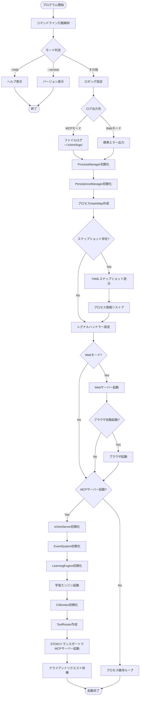

## 詳細フロー

### 1. コマンドライン引数解析

サポートされるオプション：
- `--help`, `-h`: ヘルプ表示
- `--version`, `-v`: バージョン表示
- `--web`: Web ダッシュボードを MCP サーバーと並行起動
- `--web-only`: MCP サーバーなしで Web ダッシュボードのみ起動
- `--web-port PORT`: Web ダッシュボードのポート指定（デフォルト: 12700）
- `--no-open`: ブラウザ自動起動を無効化
- `--app-mode`: ブラウザをアプリモード（専用ウィンドウ）で起動

### 2. ロギング設定

起動モードによってログ出力先が変わります：

#### MCP モード（デフォルト）
- **出力先**: `~/.ichimi/logs/ichimi-mcp-YYYYMMDD-HHMMSS.log`
- **理由**: stdio を MCP 通信に使用するため、ログは別ファイルに出力
- **設定**: ファイルアペンダー、ANSI カラー無効

#### Web モードまたは MCP+Web モード
- **出力先**: 標準エラー出力（stderr）
- **設定**: ANSI カラー無効

### 3. ProcessManager 初期化

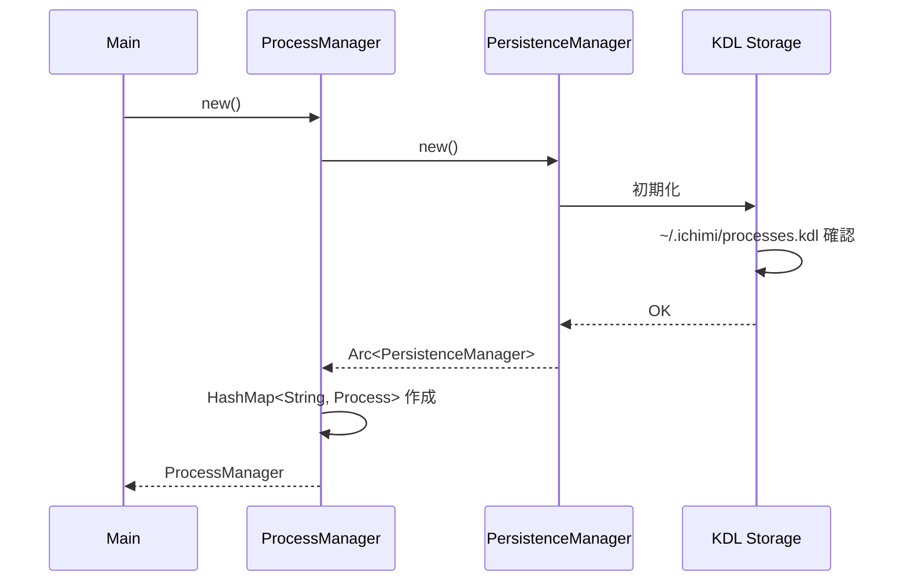

**初期化内容**：
- `PersistenceManager` の初期化
  - KDL 形式のストレージ初期化
  - データディレクトリ: `~/.ichimi/`
  - 設定ファイル: `~/.ichimi/processes.kdl`
- プロセス管理用 `HashMap` の作成（`Arc<RwLock<HashMap>>`）

### 4. プロセスリストア

YAMLスナップショットからプロセス情報をリストアします：

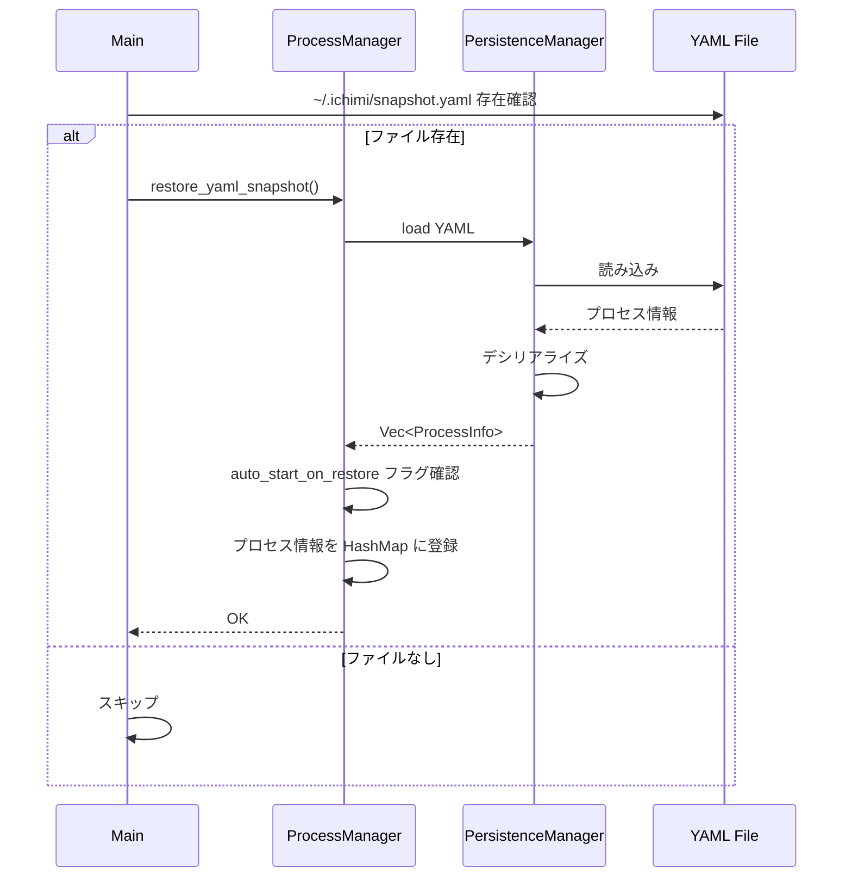

**リストア内容**：
- プロセス定義（ID、コマンド、引数、環境変数など）
- `auto_start_on_restore` フラグが `true` のプロセスは起動対象としてマーク

### 5. シグナルハンドラー設定

グレースフルシャットダウンのためのシグナルハンドラーを設定：

- **Unix系**: SIGINT (Ctrl+C), SIGTERM
- **Windows**: Ctrl+C

シグナル受信時の処理：
1. YAML スナップショット作成
2. すべてのプロセスを停止
3. ブラウザウィンドウを閉じる（app-mode の場合）
4. プログラム終了

### 6. Web サーバー起動（オプション）

`--web` または `--web-only` フラグが指定された場合：

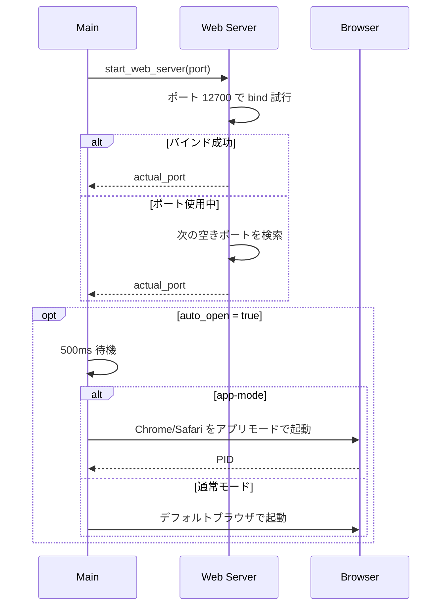

**Web サーバーの機能**：
- プロセス管理 Web UI
- RESTful API
- リアルタイムログ表示

### 7. IchimiServer 初期化

MCP サーバーのコア機能を初期化：

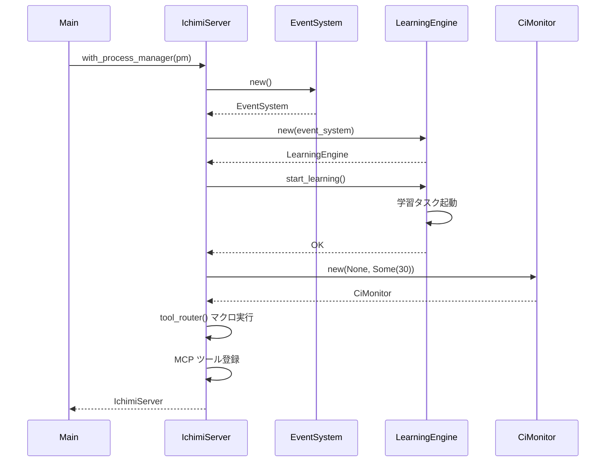

**初期化コンポーネント**：
- **EventSystem**: イベント駆動アーキテクチャのためのイベントバス
- **LearningEngine**: プロセス動作の学習と最適化
- **CiMonitor**: CI/CD パイプライン監視（ポーリング間隔: 30秒）
- **ToolRouter**: MCP ツールのルーティング（`#[tool_router]` マクロで自動生成）

### 8. MCP サーバー起動

STDIO トランスポートで MCP サーバーを起動：

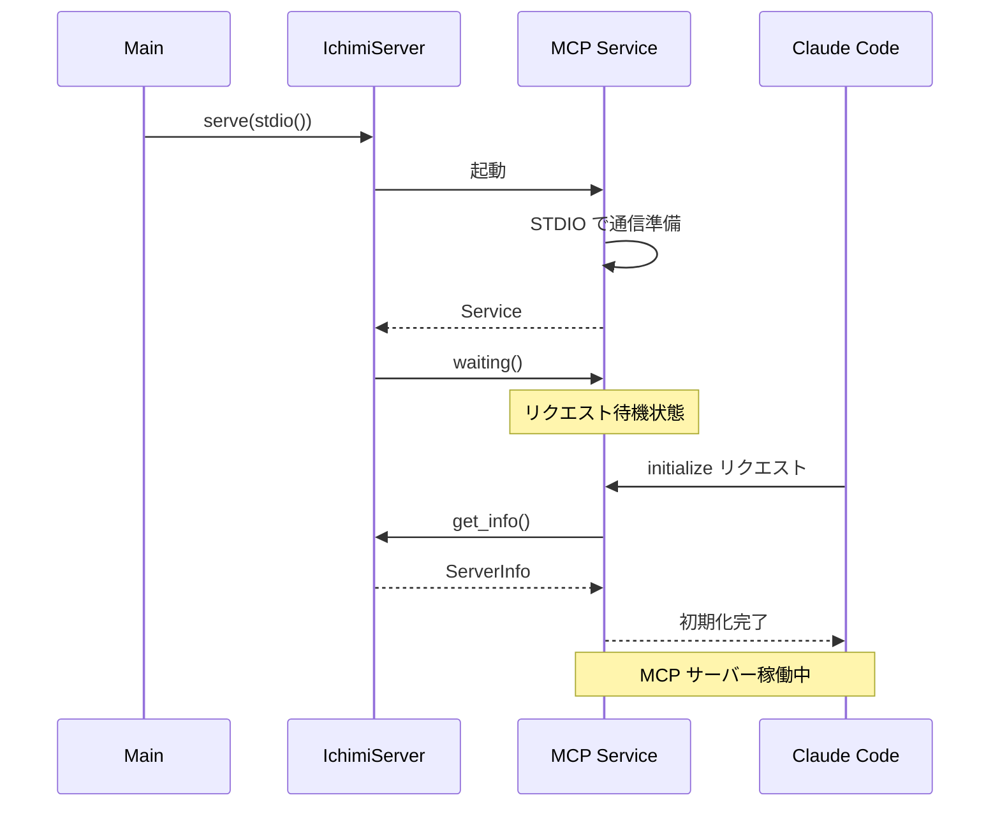

**通信方式**：
- **トランスポート**: STDIO（標準入出力）
- **プロトコル**: JSON-RPC 2.0 over MCP
- **プロトコルバージョン**: 2024-11-05

### 9. 起動完了

サーバーは以下の状態で待機：
- MCP クライアント（Claude Code）からのリクエストを受付
- Web ダッシュボード（有効な場合）でリアルタイム管理可能
- シグナル受信時はグレースフルシャットダウン

## 起動モード

### MCP モード（デフォルト）
```bash
ichimi
```
- MCP サーバーのみ起動
- Claude Code から利用可能
- ログはファイルに出力

### MCP + Web モード
```bash
ichimi --web
```
- MCP サーバーと Web ダッシュボードの両方起動
- Claude Code と Web UI の両方から管理可能

### Web のみモード
```bash
ichimi --web-only
```
- Web ダッシュボードのみ起動
- Claude Code からは利用不可
- スタンドアロンプロセスマネージャーとして動作

## 環境変数

| 変数 | 説明 | デフォルト |
|------|------|------------|
| `RUST_LOG` | ログレベル (error, warn, info, debug, trace) | info |
| `ICHIMI_IMPORT_FILE` | 起動時にインポートするファイル | ~/.ichimi/snapshot.yaml |
| `ICHIMI_EXPORT_FILE` | シャットダウン時のエクスポート先 | ~/.ichimi/snapshot.yaml |
| `ICHIMI_DATA_DIR` | データファイル用ディレクトリ | ~/.ichimi/ |
| `ICHIMI_STOP_ON_SHUTDOWN` | ichimi終了時にプロセスを停止するか（true/false） | false（継続） |

## ディレクトリ構造

```
~/.ichimi/
├── processes.kdl          # KDL形式のプロセス設定
├── snapshot.yaml          # YAMLスナップショット（バックアップ/リストア用）
├── logs/                  # ログディレクトリ（MCPモード時）
│   └── ichimi-mcp-YYYYMMDD-HHMMSS.log
└── data/                  # その他のデータファイル
```

---

## シャットダウンフロー

Ichimi サーバーの終了処理は、管理プロセスのクリーンアップとデータ保存を確実に行います。

```mermaid
flowchart TD
    Signal([シグナル受信<br/>SIGINT/SIGTERM]) --> CreateSnapshot[YAMLスナップショット作成]
    CreateSnapshot --> SaveAutoStart[auto_start_on_restore<br/>フラグ付きプロセスを保存]
    SaveAutoStart --> StopAll[全プロセスを停止]

    StopAll --> CheckProcess{プロセス実行中?}
    CheckProcess -->|Yes| StopProcess[各プロセスを停止]
    CheckProcess -->|No| CloseWebDriver

    StopProcess --> SendSIGTERM[プロセスグループに<br/>SIGTERM送信]
    SendSIGTERM --> WaitGrace[グレースピリオド待機<br/>デフォルト: 5秒]
    WaitGrace --> CheckExit{プロセス終了?}

    CheckExit -->|Yes| NextProcess[次のプロセスへ]
    CheckExit -->|No| SendSIGKILL[プロセスグループに<br/>SIGKILL送信]
    SendSIGKILL --> ForceWait[強制終了待機<br/>タイムアウト: 10秒]
    ForceWait --> NextProcess

    NextProcess --> CheckMore{他のプロセス?}
    CheckMore -->|Yes| StopProcess
    CheckMore -->|No| CloseWebDriver

    CloseWebDriver{WebDriverモード?}
    CloseWebDriver -->|Yes| CloseWD[WebDriverセッション終了]
    CloseWebDriver -->|No| CloseBrowser
    CloseWD --> CloseBrowser

    CloseBrowser{ブラウザ起動中?}
    CloseBrowser -->|Yes, App Mode| SendBrowserSIGTERM[ブラウザに<br/>SIGTERM送信]
    CloseBrowser -->|No| Exit

    SendBrowserSIGTERM --> WaitBrowser[1秒待機]
    WaitBrowser --> CheckBrowserExit{ブラウザ終了?}
    CheckBrowserExit -->|Yes| Exit
    CheckBrowserExit -->|No| KillBrowser[ブラウザ強制終了]
    KillBrowser --> Exit

    Exit([プロセス終了<br/>exit 0])
```

### シャットダウン詳細シーケンス

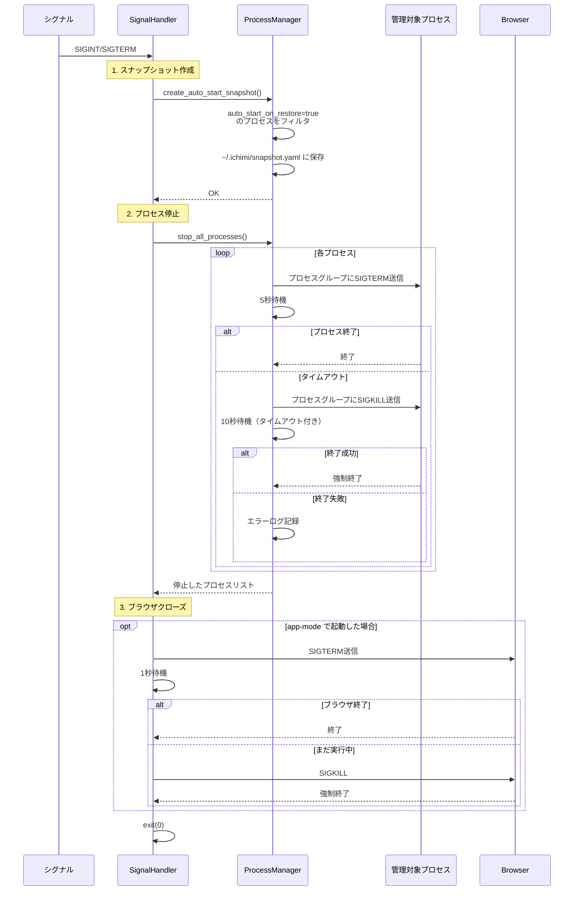

### シャットダウンの重要ポイント

1. **スナップショット作成**
   - `auto_start_on_restore` フラグが true のプロセスのみ保存
   - 次回起動時に自動復元される

2. **プロセス停止**
   - すべての管理プロセスを停止（環境変数 `ICHIMI_STOP_ON_SHUTDOWN` に関係なく常に実行）
   - プロセスグループ単位でシグナル送信（Docker対応）
   - グレースフルシャットダウンを試みた後、必要に応じて強制終了

3. **ブラウザクリーンアップ**
   - app-mode で起動したブラウザウィンドウは確実に終了

---

## 重要な機能フロー

### プロセス起動フロー（プロセスグループ対応）

v0.2.1 で改善されたプロセス起動フローです。Docker などの子プロセスを持つプロセスを確実に停止できます。

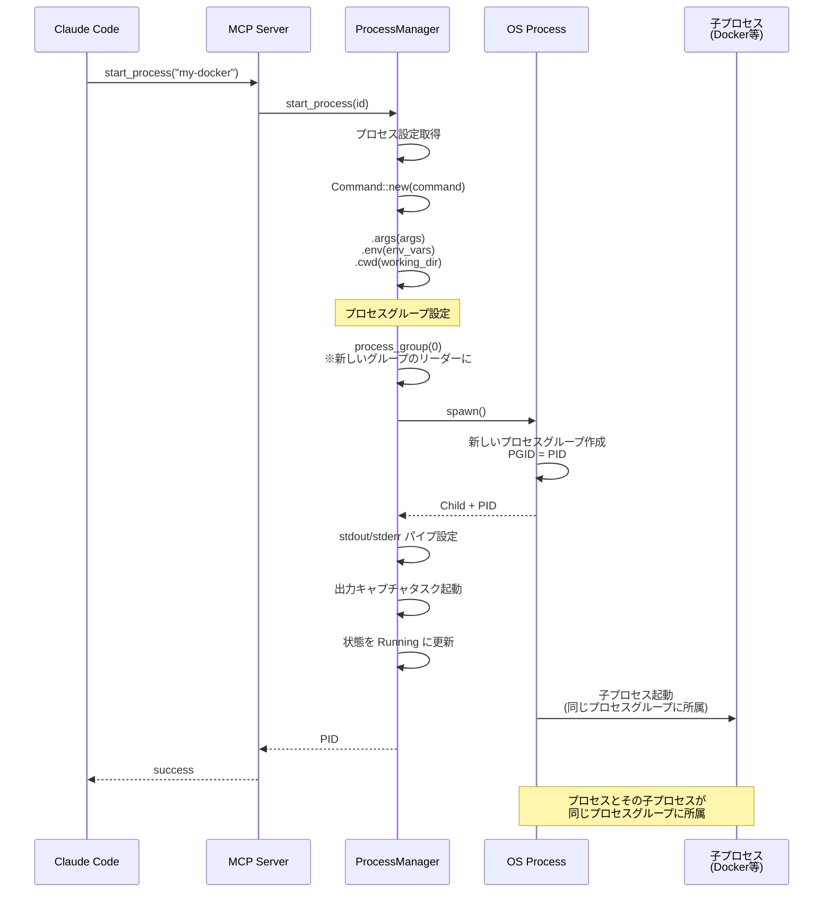

**重要な改善点（v0.2.1）**：
- `process_group(0)` で新しいプロセスグループのリーダーとして起動
- 子プロセス（Docker コンテナなど）も同じプロセスグループに所属
- 停止時にプロセスグループ全体にシグナル送信可能

### プロセス停止フロー（Docker 対応）

Docker プロセスとコンテナを確実に停止する改善されたフローです。

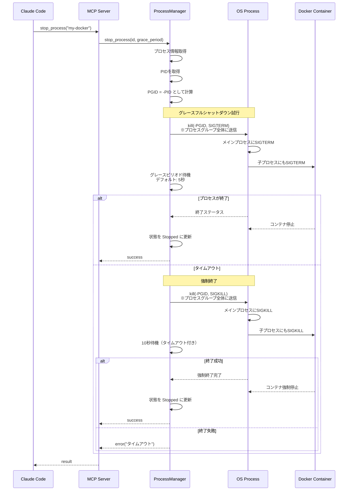

**プロセスグループシグナルの効果**：
1. 負の PID（`-PGID`）でシグナル送信
2. プロセスグループ全体（メイン + 子プロセス）にシグナルが届く
3. Docker の場合：
   - `docker run` プロセスが SIGTERM を受信
   - Docker がコンテナにシグナルを転送
   - コンテナとプロセスの両方が終了

### Web サーバー連携フロー

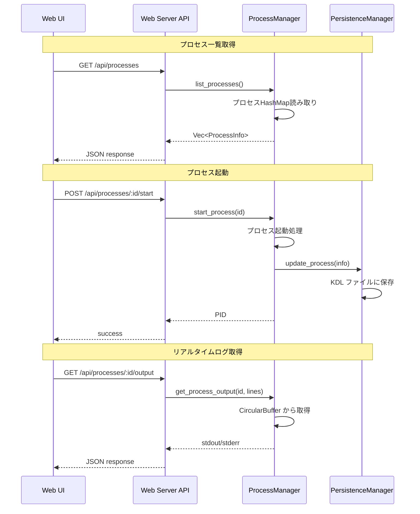

### スナップショット保存・復元フロー

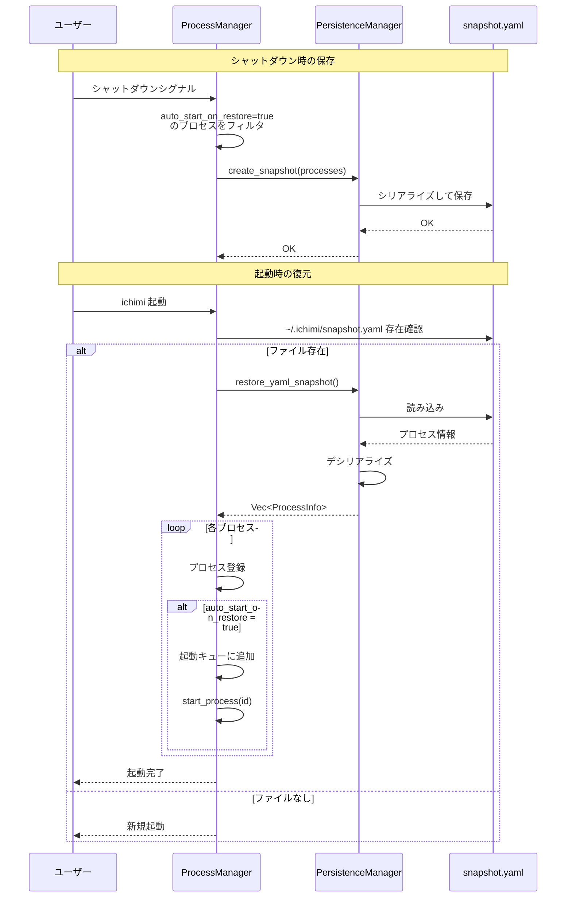

## プロセス状態遷移図

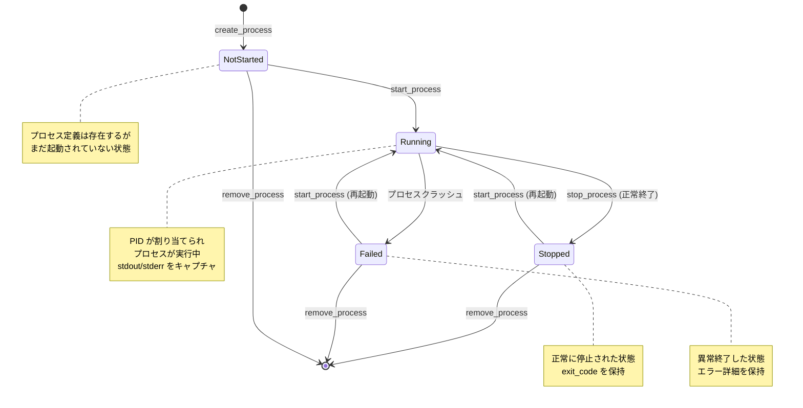

## 関連ドキュメント

- [CLAUDE.md](../.claude/CLAUDE.md) - プロジェクト概要とアーキテクチャ
- [README.md](../README.md) - ユーザー向けドキュメント
