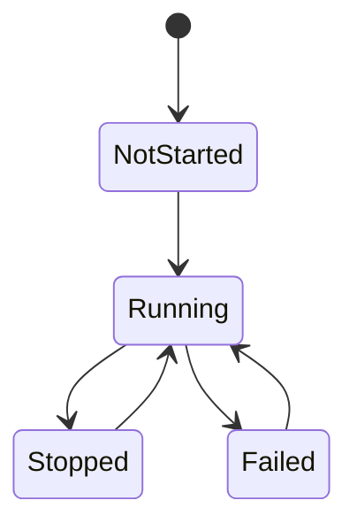

# Vantage MCP 仕様書 - サマリー

## 📊 作成済み仕様書

### ページ仕様（spec/pages/）

| 仕様書 | 目的 | 主要機能 |
|--------|------|----------|
| [processes.md](./pages/processes.md) | プロセス状態の瞬時把握と操作 | リスト表示、3D可視化、一括操作、リアルタイム更新 |
| [templates.md](./pages/templates.md) | プロセス設定の再利用性向上 | テンプレート作成/編集、使用回数追跡、エクスポート/インポート |

### プロセス管理仕様（spec/processes/）

| 仕様書 | 目的 | 主要機能 |
|--------|------|----------|
| [lifecycle.md](./processes/lifecycle.md) | プロセス状態遷移の明確化 | 4状態（NotStarted/Running/Stopped/Failed）、状態遷移ルール |
| [auto-start.md](./processes/auto-start.md) | サーバー起動時の自動起動 | auto_start_on_restore フラグ、起動順序制御（将来） |
| [shutdown.md](./processes/shutdown.md) | サーバー終了時の動作定義 | グレースフルシャットダウン、スナップショット保存 |

### アーキテクチャ仕様（spec/architecture/）

| 仕様書 | 目的 | 主要機能 |
|--------|------|----------|
| [directory-structure.md](./architecture/directory-structure.md) | ディレクトリ構成の最適化 | features/shared/core 3層構造、リファクタリング手順 |

## 🎯 仕様書のハイライト

### プロセス管理ページ（processes.md）

**瞬時に把握** - 主要な設計目標
- 6プロセスの状態を **2秒以内**に把握
- 3D可視化で依存関係を **5秒以内**に理解
- バッチ操作で **従来の1/3の時間**で完了

**4つのビューモード**:
- List Mode: 監視向け縦一列配置
- Graph Mode: 依存関係の循環ネットワーク
- Control Mode: 操作向けグリッド配置
- Edit Mode: 編集向けフォーカス+コンテキスト

**状態の視覚表現**:
- Running: Creative Magenta + パルス
- Stopped: Provision Cyan
- Failed: Bradcast Pink + 点滅

### テンプレート管理（templates.md）

**再利用性の向上** - 頻繁に使う設定を保存
- SurrealDBでの永続化
- 使用回数の自動追跡
- JSON/YAMLエクスポート/インポート

**データモデル**:
```surql
DEFINE TABLE template SCHEMAFULL;
DEFINE FIELD name ON template TYPE string;
DEFINE FIELD use_count ON template TYPE int DEFAULT 0;
DEFINE INDEX unique_template_name ON template FIELDS name UNIQUE;
```

### プロセスライフサイクル（lifecycle.md）

**明確な状態遷移** - 一貫性のある動作



**並行制御**:
- `Arc<RwLock<ProcessManager>>` による安全な並行アクセス
- 読み取りロック: 複数同時可能
- 書き込みロック: 排他的

### 自動起動（auto-start.md）

**開発環境の迅速化** - コマンド1つで全て起動

**起動シーケンス**:
1. スナップショット復元
2. auto_start_on_restore=true のプロセス抽出
3. 順次起動（依存関係順は将来実装）
4. エラー時は次のプロセスに進む

**環境変数**:
- `VANTAGE_AUTO_START_ENABLED`: 自動起動の有効/無効
- `VANTAGE_AUTO_START_DELAY_MS`: 起動間の待機時間

### シャットダウン（shutdown.md）

**データ損失の防止** - グレースフルシャットダウン

**2つのモード**:
1. **プロセス継続**（デフォルト）
   - `VANTAGE_STOP_ON_SHUTDOWN=false`
   - プロセスは停止せず、スナップショットのみ保存

2. **プロセス停止**
   - `VANTAGE_STOP_ON_SHUTDOWN=true`
   - SIGTERM → 猶予期間 → SIGKILL
   - 全プロセス停止後にスナップショット保存

**自動保存**:
- 終了時に必ずスナップショット保存
- アトミックファイル書き込み（tmp → rename）
- SurrealDB または YAML ファイル

### ディレクトリ構成（directory-structure.md）

**美しい構成への道筋** - features/shared/core 3層構造

**提案する構成**:
```
ui/web/src/
├── features/           # 機能モジュール（ドメイン駆動）
│   ├── processes/
│   ├── templates/
│   ├── clipboard/
│   └── settings/
├── shared/             # 共通モジュール（再利用可能）
│   ├── components/
│   ├── composables/
│   ├── lib/
│   └── styles/
└── core/               # コアシステム（アプリ基盤）
    ├── api/
    ├── i18n/
    ├── router/
    └── theme/
```

**依存関係ルール**:
- features → shared ✅
- features → core ✅
- features ↔ features ❌（独立性）
- shared → core ✅
- shared ↔ features ❌（汎用性）

**リファクタリング手順**:
1. ディレクトリ作成
2. features/ への移動
3. shared/ への移動
4. core/ への移動
5. インポートパスの更新
6. 古いディレクトリの削除

## 📈 次のステップ

### 1. 仕様書の拡充（優先度: 高）

以下の仕様書を追加作成：
- [ ] `spec/pages/clipboard.md` - クリップボード管理ページ
- [ ] `spec/pages/settings.md` - 設定ページ
- [ ] `spec/processes/monitoring.md` - プロセス監視仕様
- [ ] `spec/architecture/state-management.md` - Pinia ストア設計
- [ ] `spec/architecture/theme-system.md` - OKLCH テーマシステム
- [ ] `spec/architecture/3d-ui-system.md` - 3D UI アーキテクチャ

### 2. ディレクトリ構成のリファクタリング（優先度: 中）

`spec/architecture/directory-structure.md` の手順に従って実施：
- [ ] features/shared/core ディレクトリ作成
- [ ] ファイル移動とインポートパス更新
- [ ] ビルドの検証
- [ ] 古いディレクトリの削除

### 3. 実装との同期（優先度: 高）

仕様書と実際のコードが一致しているか確認：
- [ ] プロセスライフサイクルの実装確認
- [ ] 自動起動機能の実装確認
- [ ] シャットダウン処理の実装確認

## 🔗 関連ドキュメント

- [README.md](../README.md) - プロジェクト概要
- [CLAUDE.md](../CLAUDE.md) - Claude Code ガイダンス
- [CHANGELOG.md](../CHANGELOG.md) - 変更履歴
- [Projects/WebXR/](../Projects/WebXR/) - 3D UI 技術調査資料

---

**Note**: この仕様書は生きたドキュメントです。実装と並行して継続的に更新します。
