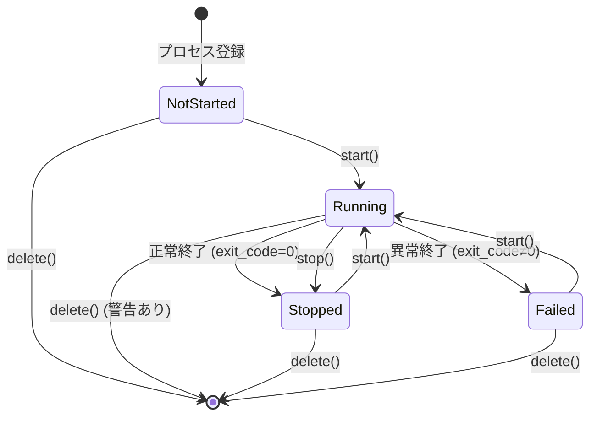

# プロセスライフサイクル - 仕様書

## 目的

Vantage MCP で管理するプロセスの**状態遷移とライフサイクル**を明確に定義し、一貫性のある動作を保証する。

### 解決する課題

- **状態の曖昧さ**: プロセスがどの状態にあるか不明確
- **不正な遷移**: 許可されていない状態遷移が発生
- **エラーハンドリング**: 異常終了時の挙動が未定義

## プロセス状態

プロセスは以下の 3 つの状態を持ちます：

### 1. NotStarted（未起動）

**説明**: プロセスが登録されているが、まだ起動されていない状態

**特徴**:
- PID なし
- stdout/stderr なし
- started_at なし

**可能な操作**:
- ✅ 起動 (→ Running)
- ✅ 削除
- ❌ 停止（エラー）

### 2. Running（実行中）

**説明**: プロセスが起動し、実行中の状態

**特徴**:
- PID あり
- stdout/stderr をリアルタイムキャプチャ
- started_at あり
- exit_code なし

**可能な操作**:
- ✅ 停止 (→ Stopped)
- ✅ ログ取得
- ❌ 起動（エラー）
- ⚠️ 削除（警告：実行中のプロセスを削除しますか？）

**自動遷移**:
- プロセスが正常終了 → Stopped
- プロセスが異常終了 → Failed

### 3. Stopped（停止）

**説明**: プロセスが正常に終了した状態（exit_code = 0）

**特徴**:
- PID なし（プロセス終了済み）
- stdout/stderr は保持
- started_at あり
- stopped_at あり
- exit_code = 0

**可能な操作**:
- ✅ 起動 (→ Running)
- ✅ 削除
- ❌ 停止（エラー）

### 4. Failed（異常終了）

**説明**: プロセスが異常終了した状態（exit_code ≠ 0）

**特徴**:
- PID なし（プロセス終了済み）
- stdout/stderr は保持（エラーログ確認可能）
- started_at あり
- stopped_at あり
- exit_code ≠ 0
- error メッセージ

**可能な操作**:
- ✅ 起動 (→ Running、再試行)
- ✅ 削除
- ❌ 停止（エラー）

## 状態遷移図



## 状態遷移の詳細

### プロセス登録 (create_process)

**前提**: なし

**操作**: `create_process(id, command, args, env, cwd, auto_start_on_restore)`

**結果**:
- 状態: NotStarted
- created_at: 現在時刻
- データベースに保存

**エラー**:
- プロセス ID が重複している → `ProcessAlreadyExists`

### プロセス起動 (start_process)

**前提**: 状態が NotStarted, Stopped, Failed のいずれか

**操作**: `start_process(id)`

**処理**:
1. コマンドを tokio::process::Command で実行
2. PID を取得
3. stdout/stderr を非同期タスクでキャプチャ開始
4. 状態を Running に変更
5. started_at を現在時刻に設定

**結果**:
- 状態: Running
- pid: プロセスの PID
- started_at: 起動時刻

**エラー**:
- プロセスが存在しない → `ProcessNotFound`
- 既に Running 状態 → `ProcessAlreadyRunning`
- コマンド実行に失敗 → `ProcessStartFailed`（状態は NotStarted のまま）

### プロセス停止 (stop_process)

**前提**: 状態が Running

**操作**: `stop_process(id, grace_period_ms)`

**処理**:
1. SIGTERM を送信
2. grace_period_ms 待機（デフォルト: 3000ms）
3. まだ生きていれば SIGKILL 送信
4. プロセス終了を確認
5. 状態を Stopped に変更
6. stopped_at を現在時刻に設定
7. exit_code を 0 に設定

**結果**:
- 状態: Stopped
- pid: None
- stopped_at: 停止時刻
- exit_code: 0

**エラー**:
- プロセスが存在しない → `ProcessNotFound`
- 既に停止している → `ProcessNotRunning`
- 強制終了に失敗 → `ProcessStopFailed`

### プロセス削除 (remove_process)

**前提**: なし（全ての状態で可能）

**操作**: `remove_process(id)`

**処理**:
1. 状態が Running の場合、警告を返す（確認が必要）
2. データベースからプロセスを削除
3. メモリから削除

**結果**:
- プロセスが管理対象から削除される

**警告**:
- Running 状態の場合: "プロセスは実行中です。削除する前に停止してください。"

### 自動遷移（正常終了）

**トリガー**: プロセスが自然終了し、exit_code = 0

**処理**:
1. プロセスの終了を検知（tokio::process::Child::wait）
2. 状態を Stopped に変更
3. stopped_at を現在時刻に設定
4. exit_code を 0 に設定

**結果**:
- 状態: Stopped
- stopped_at: 終了時刻
- exit_code: 0

### 自動遷移（異常終了）

**トリガー**: プロセスが自然終了し、exit_code ≠ 0

**処理**:
1. プロセスの終了を検知（tokio::process::Child::wait）
2. 状態を Failed に変更
3. stopped_at を現在時刻に設定
4. exit_code を実際のコードに設定
5. error メッセージを生成（"Process exited with code {exit_code}"）

**結果**:
- 状態: Failed
- stopped_at: 終了時刻
- exit_code: 実際の終了コード
- error: エラーメッセージ

## データモデル

### Rust 構造体（crates/vantage-atom/src/messages/process.rs）

```rust
#[derive(Debug, Clone, Serialize, Deserialize)]
pub enum ProcessState {
    NotStarted,
    Running {
        pid: u32,
        started_at: String, // ISO 8601
    },
    Stopped {
        exit_code: i32,
        started_at: String,
        stopped_at: String,
    },
    Failed {
        exit_code: i32,
        error: String,
        started_at: String,
        stopped_at: String,
    },
}

#[derive(Debug, Clone, Serialize, Deserialize)]
pub struct Process {
    pub id: String,
    pub command: String,
    pub args: Vec<String>,
    pub env: HashMap<String, String>,
    pub cwd: Option<String>,
    pub state: ProcessState,
    pub auto_start_on_restore: bool,
    pub created_at: String,
}
```

### SurrealDB スキーマ

```surql
DEFINE TABLE process SCHEMAFULL;

DEFINE FIELD id ON process TYPE string;
DEFINE FIELD command ON process TYPE string;
DEFINE FIELD args ON process TYPE array;
DEFINE FIELD env ON process TYPE object;
DEFINE FIELD cwd ON process TYPE option<string>;
DEFINE FIELD state ON process TYPE object;  -- JSON serialized ProcessState
DEFINE FIELD auto_start_on_restore ON process TYPE bool;
DEFINE FIELD created_at ON process TYPE string;

DEFINE INDEX unique_process_id ON process FIELDS id UNIQUE;
```

## エラーハンドリング

### ProcessNotFound

**発生条件**: 存在しないプロセス ID に対して操作を実行

**メッセージ**: "Process '{id}' not found"

**対処**: プロセス一覧を確認し、正しい ID を指定

### ProcessAlreadyExists

**発生条件**: 既に存在するプロセス ID で新規作成を試行

**メッセージ**: "Process '{id}' already exists"

**対処**: 別の ID を使用するか、既存プロセスを削除

### ProcessAlreadyRunning

**発生条件**: Running 状態のプロセスを起動しようとした

**メッセージ**: "Process '{id}' is already running"

**対処**: 起動済みのため、操作不要

### ProcessNotRunning

**発生条件**: NotStarted/Stopped/Failed 状態のプロセスを停止しようとした

**メッセージ**: "Process '{id}' is not running"

**対処**: 既に停止済みのため、操作不要

### ProcessStartFailed

**発生条件**: コマンド実行に失敗（コマンドが存在しない、権限不足など）

**メッセージ**: "Failed to start process '{id}': {reason}"

**対処**:
- コマンドパスを確認
- 実行権限を確認
- 環境変数を確認

### ProcessStopFailed

**発生条件**: SIGKILL 送信後もプロセスが終了しない

**メッセージ**: "Failed to stop process '{id}': {reason}"

**対処**:
- OS レベルでプロセスを強制終了
- システム再起動

## 並行制御

### ロック戦略

Vantage MCP は `Arc<RwLock<ProcessManager>>` を使用し、以下のロック戦略を採用：

**読み取りロック（複数同時可能）**:
- プロセス一覧取得
- プロセス状態取得
- ログ取得

**書き込みロック（排他）**:
- プロセス起動
- プロセス停止
- プロセス削除
- 状態更新

### 競合の防止

**シナリオ**: 同時に2つのリクエストが同じプロセスを起動しようとした

**対処**:
1. 最初のリクエストが書き込みロックを取得
2. プロセス状態を NotStarted → Running に変更
3. ロック解放
4. 2つ目のリクエストが書き込みロックを取得
5. 状態が Running のため `ProcessAlreadyRunning` エラーを返す

## テストケース

### TC-001: 正常な起動・停止サイクル

**操作**:
1. プロセス作成 → NotStarted
2. プロセス起動 → Running
3. プロセス停止 → Stopped

**期待結果**: 全ての遷移が成功

### TC-002: 異常終了の検知

**操作**:
1. プロセス起動（即座に異常終了するコマンド）
2. 自動遷移を待機

**期待結果**:
- 状態が Failed に変わる
- exit_code ≠ 0
- error メッセージあり

### TC-003: 不正な遷移の拒否

**操作**:
1. プロセス作成 → NotStarted
2. プロセス停止を試行

**期待結果**: `ProcessNotRunning` エラー

### TC-004: 並行起動の防止

**操作**: 同時に2つのリクエストでプロセス起動

**期待結果**:
- 1つ目は成功
- 2つ目は `ProcessAlreadyRunning` エラー

## 制約

- **PID の再利用**: プロセス終了後、PID は OS によって再利用される可能性があるため、PID のみで識別しない
- **ゾンビプロセス**: 親プロセス（Vantage）が終了しても、子プロセスは生き続ける可能性あり（`VANTAGE_STOP_ON_SHUTDOWN=true` で制御）

## 今後の拡張

- **再起動ポリシー**: 異常終了時に自動再起動（max_retries 設定）
- **ヘルスチェック**: 定期的にプロセスの健全性を確認
- **依存関係**: プロセス A が起動したらプロセス B を起動

## 更新履歴

| 日付 | 変更者 | 変更内容 | 理由 |
|------|--------|----------|------|
| 2025-11-02 | Claude Code | 初版作成 | 仕様の明確化 |
